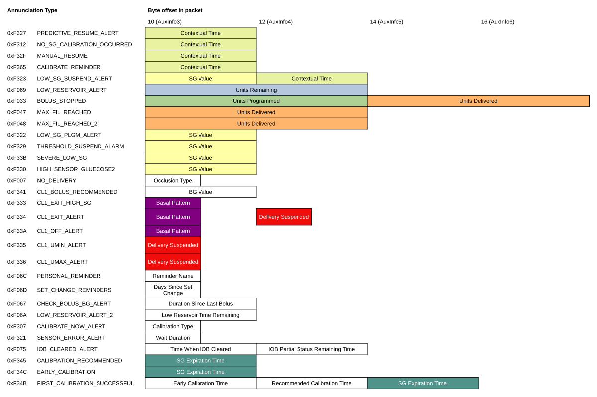

# Insulin Delivery Service

## Introduction

The Bluetooth SIG actually specifies an official _Insulin Delivery Profile_ (IDP). It defines two roles:

* _Insulin Delivery Sensor_ (in our case: the pump, an _Insulin Delivery Device_ (IDD))
* _Collector_ (in our case: the MiniMed Mobile app)

The _Insulin Delivery Sensor_ provides, among other services, the _Insulin Delivery Service_ (IDS, UUID 0x183A) and associated characteristics. Through them, a device can "control the IDD" and "obtain its status and historical therapy data" [[IDP]](#ref-idp).

For simplicity, we will mostly refer to _pump_ and _app_ instead of _Insulin Delivery Sensor_ and _Collector_ in this documentation.

The pump in question provides an _Insulin Delivery Service_, but it has a custom UUID that differs from the one defined in the standard [[IDS]](#ref-ids). This is a Medtronic custom GATT service nearly all of whose characteristics are SAKE-encoded.

Judging by their names, Medtronic's version of the IDS is actually comprised of the same characteristics as the one specified in the standard, only with Medtronic's own UUIDs; with the exception of the _IDD Record Access Control Point_ (UUID 0x2B27) which is replaced by the _Record Access Control Point_ (UUID 0x2A52). So it seems save to assume that this service is an implementation of the IDS specified in [[IDS]](#ref-ids); maybe only with some non-standard extensions (such as the SAKE encryption).

## IDD Features

This characteristic can be read to determine the supported features of the pump. It is based on the homonymous characteristic defined in [[IDS]](#ref-ids). The only difference being an extended _Flags_ field (due to bit 23 being set) with additional custom Medtronic entries.

If the _E2E-Protection Supported_ bit is set in the _Flags_ field, the optional fields _E2E-Counter_ and _E2E-CRC_ field in the other characteristics of this service must be included and populated with a CRC over the data. See [[IDS, sec. 3.1]](#ref-ids) for the specifics. Note that this goes both ways: The CRC must be included in all our requests, and the pump will also add it in its responses.

The _E2E-Protection Supported_ bit never seems to be set for a 780G pump.

The spec requires the _IDD Features_ to be static during a connection. So reading this characteristic _once_ is sufficient. The features will not change in the middle of a connection. Its structure looks like this:

Field Name                   | Data Type   | Size (octets) | Unit
-----------------------------|-------------|---------------|------
E2E-CRC                      | u16         | 2             | N/A
E2E-Counter                  | u8          | 1             | N/A
Insulin Concentration        | f16         | 2             | IU/mL
Flags                        | ≥ 24 bit    | ≥ 3           | None

Bits in the _Flags_ field are defined as follows (Medtronic's custom extensions marked):

Bit   | Definition                                   | Description
------|----------------------------------------------|-------------
 0–23 | see [[IDS, sec. 4.4.2]](#ref-ids)            |
24    | Reservoir Size 300 IU Supported              | custom extension
25    | Glucose Unit mg/dL Used                      | custom extension
26    | LGS Feature Supported                        | custom extension
27    | PLGM Feature Supported                       | custom extension
28    | HCL Feature Supported                        | custom extension
29    | Smart Settings Supported                     | custom extension
30    | Remote Bolus Supported                       | custom extension
31    | Feature Extension 1                          | custom extension; If this bit is set, an additional octet is attached (bits 32–39).
32    | Extended Timestamp Supported                 | custom extension
33    | Extended Time Of Sensor Expiration Supported | custom extension
34    | Sensor Warm-up Time Remaining Supported      | custom extension
35    | Sensor Calibration Status Icon Supported     | custom extension
36    | Two Calibration One Day Supported            | custom extension
37    | Matrix Menu Supported                        | custom extension

## IDD Status

This characteristic is based on the homonymous characteristic defined in [[IDS, sec. 4.2]](#ref-ids) but contains some extensions.

Field Name                  | Data Type    | Size (octets) | Unit
----------------------------|--------------|---------------|------
Therapy Control State       | Enum of u8   | 1             | None
Operational State           | Enum of u8   | 1             | None
Reservoir Remaining Amount  | f32          | 4             | IU
Flags                       | 8 bit        | 1             | None
Sensor Connectivity State   | 8 bit        | 1             | None
Sensor Message State        | Enum of u8   | 1             | None
E2E-Counter                 | u8           | 0 or 1        | N/A
E2E-CRC                     | u16          | 0 or 2        | N/A

See the spec for values of fields _Therapy Control State_, _Operational State_, _Flags_.

Bits in the _Sensor Connectivity State_ field are defined as follows:

Bit | Definition                        | Description
----|-----------------------------------|-------------
 0  | Sensor On                         | sensor enabled on the pump
 1  | Sensor Paired                     | transmitter paired to pump
 2  | GST Signal Lost                   | no transmitter signal (transmitter out of range or in charger)
 3  | Sensor GST Detached               | no sensor connected to transmitter

The following values are defined for the _Sensor Message State_ field:

Value | Definition
------|------------
0x00  | No Message
0x01  | Wait To Calibrate
0x02  | Do Not Calibrate
0x03  | Calibration Required
0x04  | Calibrating
0x05  | Searching For Sensor Signal
0x06  | No Sensor Signal
0x07  | Change Sensor
0x08  | Warm-up
0x09  | SG Below Lower Limit
0x0a  | SG Above Upper Limit
0x0b  | GST Battery Depleted
0x0c  | Sensor Connected
0x0d  | Waiting Warm-up
0x0e  | No Paired Sensor

## IDD Status Changed

This characteristic can be read to determine various status changes of the pump. It is based on the homonymous characteristic defined in [[IDS]](#ref-ids). The app can also configure this characteristic for indications to automatically receive the status changes when they happen.

The specified characteristic value consists of a single 16-bit flags field. Medtronic extends this to up to 48 bits in their version. They also populate some of the reserved bits with their custom ones. The extension mechanism is very similar to the one in _IDD Features_: If the highest bit in the current block is _set_, another block of 16 bits is appended, thus extending the flags.

Field Name    | Data Type    | Size (octets) | Unit
--------------|--------------|---------------|------
Flags         | 16–48 bit    | 2–6           | None
E2E-Counter   | u8           | 0 or 1        | N/A
E2E-CRC       | u16          | 0 or 2        | N/A

Per the spec, the pump is expected to retain the status of a bit of the _Flags_ field until its value is reset by the app through the _Reset Status_ procedure using the characteristic _IDD Status Reader Control Point_.

Bits in the _Flags_ field are defined as follows (Medtronic's custom extensions marked):

Bit   | Definition                               | Description
------|------------------------------------------|-------------
 0    | Therapy Control State Changed            | new value in _Therapy Control State_ field of [IDD Status](#idd-status)
 1    | Operational State Changed                | new value in _Operational State_ field of [IDD Status](#idd-status)
 2    | Reservoir Status Changed                 | new value in _Reservoir Remaining Amount_ field of [IDD Status](#idd-status)
 3    | Annunciation Status Changed              |
 4    | Total Daily Insulin Status Changed       |
 5    | Active Basal Rate Status Changed         |
 6    | Active Bolus Status Changed              |
 7    | History Event Recorded                   |
 8    | Time In Range Status Changed             | custom extension; marked as reserved in the spec
 9–14 | reserved/unused                          |
15    | Extended Status                          | custom extension; If this bit is set, two additional octets are attached (bits 16–31).
16    | Therapy Algorithm State                  | custom extension
17    | Insulin On Board                         | custom extension
18    | New CGM Measurement                      | custom extension
19    | Sensor EOL                               | custom extension; Sometimes follows bit 18 regardless of sensor health, possibly misleading name
20    | CGM Calibration                          | custom extension
21    | Sensor Status Message                    | custom extension
22    | Sensor Connectivity State                | custom extension
23    | Display Format Changed                   | custom extension
24    | High/Low Settings Changed                | custom extension
25    | Sensor Changed                           | custom extension
26    | CGM Calibration Context Changed          | custom extension
27    | CGM Time Calibration Recommended Changed | custom extension
28    | Remote Bolus Option Changed              | custom extension
29    | Local UI Interaction Requested           | custom extension
30    | Sensor Warm-up Time Remaining Changed    | custom extension
31    | Extended Status 1                        | custom extension; If this bit is set, two additional octets are attached (bits 32–47).
32    | Sensor Calibration Status Icon Changed   | custom extension
33    | Early Sensor Calibration Time Changed    | custom extension

## IDD Status Reader Control Point

This characteristic is based on the homonymous characteristic defined in [[IDS, sec. 4.5]](#ref-ids). Write a command to it (encoded by an _opcode_) to retrieve status information such as currently running boluses. The responses are sent as indications for the same characteristic. Such an indication also confirms the end of the command's execution.

### Opcodes

The spec defines a large table of opcodes encoding different commands [[IDS, table 4.14]](#ref-ids), all of which the 780G pump seems to support. Some portions of the value range are marked as "prohibited". Medtronic uses on of these for the following custom opcodes:

Value  | Definition                                  | Description
-------|---------------------------------------------|-------------
0x03fd | Get Therapy Algorithm States                | Medtronic custom
0x03fe | Get Therapy Algorithm States Response       | Medtronic custom
0x03ff | Get Display Format                          | Medtronic custom
0x0400 | Get Display Format Response                 | Medtronic custom
0x0401 | Get Time In Range Data                      | Medtronic custom
0x0402 | Get Time In Range Data Response             | Medtronic custom
0x0403 | Get Sensor Warm-up Time Remaining           | Medtronic custom
0x0404 | Get Sensor Warm-up Time Remaining Response  | Medtronic custom
0x0405 | Get Sensor Calibration Status Icon          | Medtronic custom
0x0406 | Get Sensor Calibration Status Icon Response | Medtronic custom
0x0407 | Get Early Sensor Calibration Time           | Medtronic custom
0x0408 | Get Early Sensor Calibration Time Response  | Medtronic custom

The opcodes that contain "response" in the name are used only in responses, the other ones only when sending commands.

Medtronic also slightly modifies some of the commands and responses defined in the spec:

- _Reset Status_ uses the extended _Flags_ field defined in _IDD Status Changed_
- _Get Active Basal Rate Delivery Response_ uses:
    - 4-byte floats instead of 2-byte floats for field _Active Basal Rate Current Config Value_
    - 4-byte floats instead of 2-byte floats for field _TBR Adjustment Value_
- _Get Active Bolus Delivery Response_ uses:
    - 4-byte floats instead of 2-byte floats for field _Bolus Fast Amount_
    - 4-byte floats instead of 2-byte floats for field _Bolus Extended Amount_

### Format of modified standard _Get Insulin On Board Response_

This standard response contains enough custom Medtronic extensions to warrant documentation here:

Field Name                   | Data Type    | Size (octets) | Unit
-----------------------------|--------------|---------------|------
Response Opcode              | Value 0x03fc | 2             | None
Flags                        | 8 bit        | 1             | None
Insulin On Board             | f32          | 4             | IU
Remaining Duration           | u16          | 0 or 2        | minutes
IOB Partial Status Duration  | u16          | 0 or 2        | minutes (?)
IOB Partial Status Remaining | u16          | 0 or 2        | ???
E2E-Counter                  | u8           | 0 or 1        | N/A
E2E-CRC                      | u16          | 0 or 2        | N/A

Bits in the _Flags_ field are defined as follows:

Bit | Definition                 | Description
----|----------------------------|-------------
0   | Remaining Duration Present | If this bit is set, field _Remaining Duration_ is present
1   | IOB Partial Status Present | If this bit is set, fields _IOB Partial Status Duration_ and _IOB Partial Status Remaining_ are present (Medtronic custom)

### Format of custom _Get Therapy Algorithm States_ command and response

#### Command structure

Field Name    | Data Type    | Size (octets) | Unit
--------------|--------------|---------------|------
Opcode        | Value 0x03fd | 2             | None
E2E-Counter   | u8           | 0 or 1        | N/A
E2E-CRC       | u16          | 0 or 2        | N/A

#### Response structure

Field Name                 | Data Type    | Size (octets) | Unit
---------------------------|--------------|---------------|------
Response Opcode            | Value 0x03fe | 2             | None
Flags                      | 16 bit       | 2             | None
Auto Mode Shield State     | Enum of u8   | 0 or 1        | None
Auto Mode Readiness State  | Enum of u8   | 0 or 1        | None
PLGM State                 | Enum of u8   | 0 or 1        | None
LGS State                  | Enum of u8   | 0 or 1        | None
Temp Target Duration       | u16          | 0 or 2        | minutes (?)
Wait To Calibrate Duration | u16          | 0 or 2        | minutes (?)
Safe Basal Duration        | u16          | 0 or 2        | minutes (?)
E2E-Counter                | u8           | 0 or 1        | N/A
E2E-CRC                    | u16          | 0 or 2        | N/A

Bits in the _Flags_ field are defined as follows:

Bit | Definition                | Description
----|---------------------------|-------------
0   | Auto Mode Present         | If this bit is set, fields _Auto Mode Shield State_ and _Auto Mode Readiness State_ are present
1   | LGS Present               | If this bit is set, field _LGS State_ is present
2   | PLGM Present              | If this bit is set, field _PLGM State_ is present
3   | Temp Target Present       | If this bit is set, field _Temp Target Duration_ is present
4   | Wait To Calibrate Present | If this bit is set, field _Wait To Calibrate Duration_ is present
5   | Safe Basal Present        | If this bit is set, field _Safe Basal Duration_ is present

The following values are defined for the _Auto Mode Shield State_ field:

Value | Definition
------|------------
0x01  | Open Loop
0x02  | Auto Basal Mode
0x03  | Safe Basal Mode

The following values are defined for the _Auto Mode Readiness State_ field:

Value | Definition
------|------------
0x00  | No Action Required
0x01  | BG Required
0x02  | Processing BG
0x03  | Waiting To Enter BG
0x04  | Calibration Required
0x05  | BG Recommended

The following values are defined for the _PLGM State_ field:

Value | Definition
------|------------
0x00  | Feature On SG Unavailable
0x01  | Feature On Suspended
0x02  | Feature On

The following values are defined for the _LGS State_ field:

Value | Definition
------|------------
0x00  | Feature On SG Unavailable
0x01  | Feature On Suspended
0x02  | Feature On

### Format of custom _Get Display Format_ command and response

#### Command structure

Field Name    | Data Type    | Size (octets) | Unit
--------------|--------------|---------------|------
Opcode        | Value 0x03ff | 2             | None
E2E-Counter   | u8           | 0 or 1        | N/A
E2E-CRC       | u16          | 0 or 2        | N/A

#### Response structure

Field Name                 | Data Type    | Size (octets) | Unit
---------------------------|--------------|---------------|------
Response Opcode            | Value 0x0400 | 2             | None
Flags                      | 8 bit        | 1             | None
Language                   | Enum of u8   | 0 or 1        | None
E2E-Counter                | u8           | 0 or 1        | N/A
E2E-CRC                    | u16          | 0 or 2        | N/A

Bits in the _Flags_ field are defined as follows:

Bit | Definition                | Description
----|---------------------------|-------------
0   | Time Format 24 Hours      | for display formatting
1   | Language Non-English      | for display formatting; If this bit is set, field _Language_ is present
2   | Exchange Carb Unit        | for display formatting
3–5 | reserved/unused           |
6–7 | Active Insulin Resolution | interpret this as enum (see below)

The following values are defined for the _Active Insulin Resolution_ field:

Value | Definition
------|------------
0x00  | Tenths
0x01  | Hundredths
0x02  | Thousandths

The following values are defined for the _Language_ field:

Value | Definition
------|------------
0x00  | German
0x01  | Spanish
0x02  | French
0x03  | Italian
0x04  | Dutch
0x05  | Swedish
0x06  | Czech
0x07  | Danish
0x08  | Hungarian
0x09  | Norwegian
0x0a  | Polish
0x0b  | Portugese
0x0c  | Slovene
0x0d  | Finnish
0x0e  | Turkish
0x0f  | Hebrew
0x10  | Arabic
0x11  | Russian
0x12  | Greek
0x13  | Slovak
0x14  | Chinese
0x15  | Japanese
0x16  | Korean

### Format of custom _Get Time In Range Data_ command and response

#### Command structure

Field Name    | Data Type    | Size (octets) | Unit
--------------|--------------|---------------|------
Opcode        | Value 0x0401 | 2             | None
E2E-Counter   | u8           | 0 or 1        | N/A
E2E-CRC       | u16          | 0 or 2        | N/A

#### Response structure

Field Name                 | Data Type    | Size (octets) | Unit
---------------------------|--------------|---------------|------
Response Opcode            | Value 0x0402 | 2             | None
Not Enough Data Flag       | u8           | 1             | None
Above                      | u8           | 1             | %
Below                      | u8           | 1             | %
In Range                   | u8           | 1             | %
Smart Guard                | u8           | 1             | %
E2E-Counter                | u8           | 0 or 1        | N/A
E2E-CRC                    | u16          | 0 or 2        | N/A

### Format of custom _Get Sensor Warm-up Time Remaining_ command and response

This command does not seem to be supported by the 780G pump. It always answers with _Response Code: Opcode not supported_. Maybe it is intended only for direct communication with the sensor.

#### Command structure

Field Name    | Data Type    | Size (octets) | Unit
--------------|--------------|---------------|------
Opcode        | Value 0x0403 | 2             | None
E2E-Counter   | u8           | 0 or 1        | N/A
E2E-CRC       | u16          | 0 or 2        | N/A

#### Response structure

Field Name                 | Data Type    | Size (octets) | Unit
---------------------------|--------------|---------------|------
Response Opcode            | Value 0x0404 | 2             | None
Time                       | u8           | 1             | hours (?)
E2E-Counter                | u8           | 0 or 1        | N/A
E2E-CRC                    | u16          | 0 or 2        | N/A

### Format of custom _Get Sensor Calibration Status Icon_ command and response

This command does not seem to be supported by the 780G pump. It always answers with _Response Code: Opcode not supported_. Maybe it is intended only for direct communication with the sensor.

#### Command structure

Field Name    | Data Type    | Size (octets) | Unit
--------------|--------------|---------------|------
Opcode        | Value 0x0405 | 2             | None
E2E-Counter   | u8           | 0 or 1        | N/A
E2E-CRC       | u16          | 0 or 2        | N/A

#### Response structure

Field Name                 | Data Type    | Size (octets) | Unit
---------------------------|--------------|---------------|------
Response Opcode            | Value 0x0406 | 2             | None
Value                      | u8           | 1             | None
E2E-Counter                | u8           | 0 or 1        | N/A
E2E-CRC                    | u16          | 0 or 2        | N/A

The following values are defined for the _Value_ field:

Value | Definition
------|------------
0x00  | No Icon
0x01  | Undefined
0x02  | Init
0x03  | Calibration Required Legacy
0x04  | 0 Hours
0x05  | 2 Hours
0x06  | 4 Hours
0x07  | 6 Hours
0x08  | 8 Hours
0x09  | 10 Hours
0x0a  | No Calibration Required
0x0b  | Early Calibration
0x0c  | Calibration Recommended
0x0d  | Calibration Required
0x0e  | HCL Requires BG Legacy
0x0f  | HCL requires BG

### Format of custom _Get Early Sensor Calibration Time_ command and response

This command does not seem to be supported by the 780G pump. It always answers with _Response Code: Opcode not supported_. Maybe it is intended only for direct communication with the sensor.

#### Command structure

Field Name    | Data Type    | Size (octets) | Unit
--------------|--------------|---------------|------
Opcode        | Value 0x0407 | 2             | None
E2E-Counter   | u8           | 0 or 1        | N/A
E2E-CRC       | u16          | 0 or 2        | N/A

#### Response structure

Field Name                 | Data Type    | Size (octets) | Unit
---------------------------|--------------|---------------|------
Response Opcode            | Value 0x0408 | 2             | None
Hours                      | u8           | 1             | hours
Minutes                    | u8           | 1             | minutes
E2E-Counter                | u8           | 0 or 1        | N/A
E2E-CRC                    | u16          | 0 or 2        | N/A

## IDD Command Control Point & IDD Command Data

The spec for the _Insulin Delivery Service_ defines the characteristic _IDD Command Control Point_ for "adapting therapy parameters to enable the remote operation of the insulin therapy as well as the remote operation for device maintenance" [[IDS]](#ref-ids). Together with a second characteristic _IDD Command Data_ it implements a simple "command in, data out" interface:

* _IDD Command Control Point_
	* app sends command to the pump
	* pump sends back final "command execution finished" (indications)
	* SAKE-encrypted
* _IDD Command Data_
	* pump sends back data in response (notifications)
	* SAKE-encrypted

The app (the client) writes commands to the _Command Control Point_ and receives a response from the pump (the server) either via _Command Control Point_ or _Command Data_. Commands include things like "set a bolus" or "get the basal rate profile template" [[IDS, sec. 4.6.1]](#ref-ids).

The type of command is encoded in its _opcode_. The client may send multiple commands without waiting for a response. Responses from the server also include an opcode which references the command's opcode. This allows the client to map responses to the original command.

The spec defines the following behavior: If the server wants/needs to respond to a command with more than one record (for example, lengthy basal rate profile templates), it shall use multiple _notifications_ of the _Command Data_ to do so (one per record). It shall then _indicate_ the _Command Control Point_ to confirm the end of the command's execution. Therefore, the app shall configure the _Command Data_ characteristic for notifications and the _Command Control Point_ characteristic for indications before sending its first command. Since an _indication_ in Bluetooth LE requires an acknowledgement from the client, the pump will know that the app received that final confirmation of execution.

In practice we observe a 780G pump sending notifications of the Command Data even for single-record responses that could have been sent through the _Command Control Point_. Medtronic probably chose to do so because they _always_ wanted to indicate the response code (either success or one of various error codes), which they could not simply send along with other data in the response. There is only _one_ opcode allowed per response package, and "Response Code" is one of them.

### Opcodes

The spec defines a large table of opcodes encoding different commands [[IDS, table 4.3.6]](#ref-ids). Some portions of the value range are marked as "prohibited". Medtronic uses on of these for custom opcodes. We only list the selection of opcodes defined in the MiniMed Mobile app. The pump may actually support other commands from the spec, too.

Value  | Definition                        | Description
-------|-----------------------------------|-------------
0x0f55 | Response Code                     |
0x114b | Set Bolus                         |
0x1177 | Set Bolus Response                |
0x1178 | Cancel Bolus                      |
0x1187 | Cancel Bolus Response             |
0x147d | Get Max Bolus Amount              |
0x1482 | Get Max Bolus Amount Response     |
0x148e | Get High/Low SG Settings          | Medtronic custom
0x148f | Get High/Low SG Settings Response | Medtronic custom

The opcodes that contain "response" in the name are used only in responses, the other ones only when sending commands.

### Format of _Response Code_ response

This is a special response. The pump sends it as indication on the _IDD Command Control Point_ characteristic to mark the end of command execution (i.e. expect no more responses on the _IDD Command Data_ characteristic) and also to provide a final return code in the _Response Code Value_ field. The original opcode that started the command is included in the _Request Opcode_ field.

Field Name                  | Data Type    | Size (octets) | Unit
----------------------------|--------------|---------------|------
Response Opcode             | Value 0x0f55 | 2             | None
Request Opcode              | Enum of u16  | 2             | None
Response Code Value         | Enum of u8   | 1             | None
E2E-Counter                 | u8           | 0 or 1        | N/A
E2E-CRC                     | u16          | 0 or 2        | N/A

The following values are defined for the _Response Code Value_ field:

Value | Definition
------|------------
0x0f  | Success
0x70  | Opcode not supported
0x71  | Invalid Operand
0x72  | Procedure not completed
0x73  | Parameter out of range
0x74  | Procedure not applicable
0x75  | Plausability check failed
0x76  | Maximum bolus number reached

### Format of custom _Get High/Low SG Settings_ command and response

The command is sent by writing to the _IDD Command Control Point_ characteristic. The pump responds by sending a notification for the _IDD Command Data_ characteristic.

#### Command structure

Field Name    | Data Type    | Size (octets) | Unit
--------------|--------------|---------------|------
Opcode        | Value 0x148e | 2             | None
Settings Type | Enum of u8   | 1             | None
E2E-Counter   | u8           | 0 or 1        | N/A
E2E-CRC       | u16          | 0 or 2        | N/A

The following values are defined for the _Settings Type_ field:

Value | Definition
------|------------
0x00  | Low
0x01  | High

#### Response structure

Field Name                  | Data Type    | Size (octets) | Unit
----------------------------|--------------|---------------|------
Response Opcode             | Value 0x148f | 2             | None
Flags                       | 8 bit        | 1             | None
Settings Type               | Enum of u8   | 1             | None
1st Time Block Number Index | u8           | 1             | None
1st Duration                | u16          | 2             | minutes
1st SG Limit                | f16          | 2             | see note
2nd Duration                | u16          | 0 or 2        | minutes
2nd SG Limit                | f16          | 0 or 2        | see note
3rd Duration                | u16          | 0 or 2        | minutes
3rd SG Limit                | f16          | 0 or 2        | see note
E2E-Counter                 | u8           | 0 or 1        | N/A
E2E-CRC                     | u16          | 0 or 2        | N/A

NOTE: The unit of the _SG Limit_ fields probably depends on the value of the bit _Glucose Unit mg/dL Used_ in the data read from the _IDD Feature_ characteristic. So it is likely mg/dL if the flag is set, and mmol/L otherwise.

Bits in the _Flags_ field are defined as follows:

Bit | Definition             | Description
----|------------------------|-------------
0   | 2nd Time Block Present | If this bit is set, fields _2nd Duration_ and _2nd SG Limit_ are present
1   | 3rd Time Block Present | If this bit is set, fields _3rd Duration_ and _3rd SG Limit_ are present

### Example capture

Following is an annotated capture of the MiniMed Mobile app requesting the high/low sensor glucose settings from a 780G pump. This happens in two parts: First, the app requests the _High_ settings through Medtronic's custom command. After this command has been completed by the pump, the app requests the _Low_ settings using the same command.

1. App writes command _Get High/Low SG Settings_ to the _IDD Command Control Point_:

		8e14 01
		8e14 ..  Opcode:  Get High/Low SG Settings
		.... 01  Operand: High

2. Pump responds with notification for _IDD Command Data_:

		8f14 03 01 00 e001 1801 0c03 0000 b400 1801
		8f14 .. .. .. .... .... .... .... .... ....  Response Opcode: Get High/Low SG Settings Response
		.... 03 .. .. .... .... .... .... .... ....  Operand: 2nd Time Block Present (0x1) | 3rd Time Block Present (0x2)
		.... .. 01 .. .... .... .... .... .... ....  Operand: High
		.... .. .. 00 .... .... .... .... .... ....  Operand: 1st Time Block Number Index: 0
		.... .. .. .. e001 .... .... .... .... ....  Operand: 1st Duration: 480 min
		.... .. .. .. .... 1801 .... .... .... ....  Operand: 1st SG Limit: 280.0 mg/dL
		.... .. .. .. .... .... 0c03 .... .... ....  Operand: 2nd Duration: 780 min
		.... .. .. .. .... .... .... 0000 .... ....  Operand: 2nd SG Limit: 0.0 mg/dL
		.... .. .. .. .... .... .... .... b400 ....  Operand: 3rd Duration: 180 min
		.... .. .. .. .... .... .... .... .... 1801  Operand: 3rd SG Limit: 280.0 mg/dL

	If the flag for 2nd and 3rd time block are _not_ set, the corresponding block is not part of the packet, i.e. the packet shown above would be shorter by 2 or 4 bytes, respectively.

3. Pump finishes with indication for _IDD Command Control Point_:

		550f 8e14 0f
		550f .... ..  Opcode:  Response Code
		.... 8e14 ..  Operand: Request Opcode: Get High/Low SG Settings
		.... .... 0f  Operand: Response Code Value: Success

4. App writes command _Get High/Low SG Settings_ to the _IDD Command Control Point_:

		8e14 00
		8e14 ..  Opcode:  Get High/Low SG Settings
		.... 00  Operand: Low

5. Pump responds with notification for _IDD Command Data_:

		8f14 03 00 00 c201 5000 ee02 4600 f000 5000
		8f14 .. .. .. .... .... .... .... .... ....  Response Opcode: Get High/Low SG Settings Response
		.... 03 .. .. .... .... .... .... .... ....  Operand: 2nd Time Block Present (0x1) | 3rd Time Block Present (0x2)
		.... .. 00 .. .... .... .... .... .... ....  Operand: Low
		.... .. .. 00 .... .... .... .... .... ....  Operand: 1st Time Block Number Index: 0
		.... .. .. .. c201 .... .... .... .... ....  Operand: 1st Duration: 450 min
		.... .. .. .. .... 5000 .... .... .... ....  Operand: 2nd SD Limit: 80.0 mg/dL
		.... .. .. .. .... .... ee02 .... .... ....  Operand: 2nd Duration: 750 min
		.... .. .. .. .... .... .... 4600 .... ....  Operand: 3rd SD Limit: 70.0 mg/dL
		.... .. .. .. .... .... .... .... f000 ....  Operand: 3rd Duration: 240 min
		.... .. .. .. .... .... .... .... .... 5000  Operand: 3rd SD Limit: 80.0 mg/dL

6.  Pump finishes with indication for _Command Control Point_:

		550f 8e14 0f
		550f .... ..  Opcode:  Response Code
		.... 8e14 ..  Operand: Request Opcode: Get High/Low SG Settings
		.... .... 0f  Operand: Response Code Value: Success

## Record Access Control Point & IDD History Data

Similar to the [_IDD Command_ interface](#idd-command-control-point--idd-command-data), Medtronic's _Insulin Delivery Service_ defines two characteristics _Record Access Control Point_ (_RACP_) and _IDD History Data_ that also appear in the spec [[IDS]](#ref-ids) for this service (only difference being a dedicated _IDD RACP_ in the spec). They provide a means of accessing the pump's history database which stores _events_ such as sensor values and boluses. The app can retrieve the number of stored records as well as the actual records, including optional filtering such as "last record" or "all records within a given range of sequence numbers".

The setup and workflow is analogous to that of the _IDD Command_ interface: The app sends requests through the _RACP_ and the pump sends the data by notifications of the _IDD History Data_. Since this reply can span multiple records, the pump _indicates_ the _RACP_ to confirm the end of execution.

* _Record Access Control Point_
	* app sends command to the pump
	* pump sends back final "command execution finished" (indications)
	* not encrypted (!)
* _IDD History Data_
	* pump sends back data in response (notifications)
	* SAKE-encrypted

Contrary to [[IDS, table 3.22]](#ref-ids), Medtronic not only allows an operand for opcodes _Report Records_, _Report Number of Stored Records_, and _Delete Stored Records_ in combinatation with operators _All records_, _First/Last record_ in writes to the _RACP_, it actually _requires_ the operand to be present. Its value can be either of the filter types listed for the respective combination in the following table. Other values will result in a response with _Response Code Operand not supported_.

<table>
<tr>
    <th>Op Code</th>
    <th>Operator</th>
    <th>Operand (Filter Type)</th>
</tr>
<tr>
    <td rowspan="3">Report Stored Records</td>
    <td>All records</td>
    <td>Sequence Number, Sequence Number filtered by Reference Time Event</td>
</tr>
<tr>
    <td>First record</td>
    <td>Sequence Number</td>
</tr>
<tr>
    <td>Last record</td>
    <td>Sequence Number</td>
</tr>
<tr>
    <td rowspan="3">Report Number of Stored Records</td>
    <td>All records</td>
    <td>Sequence Number</td>
</tr>
<tr>
    <td>First record</td>
    <td>Sequence Number</td>
</tr>
<tr>
    <td>Last record</td>
    <td>Sequence Number</td>
</tr>
<tr>
    <td rowspan="3">Delete Stored Records</td>
    <td>All records</td>
    <td>Sequence Number, Sequence Number filtered by Reference Time Event (?)</td>
</tr>
<tr>
    <td>First record</td>
    <td>Sequence Number (?)</td>
</tr>
<tr>
    <td>Last record</td>
    <td>Sequence Number (?)</td>
</tr>
</table>

### Format of History Data

The structure of the _IDD History Data_ responses follows the spec [[IDS, sec. 4.9]](#ref-ids) but it adds the optional _E2E-Counter_ field that the spec explicitly omits for this characteristic:

Field Name                  | Data Type    | Size (octets) | Unit
----------------------------|--------------|---------------|------
Event Type                  | Enum of u16  | 2             | None
Sequence Number             | u32          | 4             | None
Relative Offset             | u16          | 2             | seconds
Event Data                  | variable     | 0–10          | None
E2E-Counter                 | u8           | 0 or 1        | N/A
E2E-CRC                     | u16          | 0 or 2        | N/A

Medtronic defines a couple of custom event types in the spec's manufacturer-reserved range of event types. They also slightly modify existing event types defined in the spec:

- Event type _Bolus Programmed Part 1 of 2_ uses 4-byte floats for fields _Programmed Bolus Fast Amount_ and _Programmed Bolus Extended Amount_ instead of 2-byte floats
- Event type _Bolus Delivered Part 1 of 2_ uses 4-byte floats for fields _Delivered Bolus Fast Amount_ and _Delivered Bolus Extended Amount_ instead of 2-byte floats
- Event type _Delivered Basal Rate Changed_ uses 4-byte floats for fields _Old Basal Rate Value_ and _New Basal Rate Value_ instead of 2-byte floats
- Event type _Max Bolus Amount Changed_ uses 4-byte floats for fields _Old Max Bolus Amount_ and _New Max Bolus Amount_ instead of 2-byte floats

The field _Relative Offset_ encodes the event's timestamp relative to the latest event of type _NGP Reference Time_ preceeding it. The latter encodes an absolute date time and is automatically generated by the pump every hour or so.

The _Event Data_ field for the custom Medtronic event types in responses to _Report Stored Records_ requests (opcode 0x33) is structured as follows:

#### Auto Basal Delivery (event type 0xf001)

Field Name                  | Data Type    | Size (octets) | Unit
----------------------------|--------------|---------------|------
Bolus Number                | u8           | 1             | None
Bolus Amount                | f32          | 4             | IU

#### CL1 Transition (event type 0xf002)

Field Name                  | Data Type    | Size (octets) | Unit
----------------------------|--------------|---------------|------
Transition State            | Enum of u8   | 1             | None

The following values are defined for field _Transition State_:

Value | Definition
------|-----------------
0x00  | Into SI Pass
0x01  | Out User Override
0x02  | Out Alarm
0x03  | Out Timeout Safe Basal
0x04  | Out High SG

#### Therapy Context (event type 0xf004)

Field Name                      | Data Type    | Size (octets) | Unit
--------------------------------|--------------|---------------|------
Flags                           | 8 bit        | 1             | None
Basal Rate                      | f32          | 0 or 4        | IU/h (?)
Insulin Delivery Stopped Reason | Enum of u8   | 0 or 1        | None
TBR Type                        | Enum of u8   | 0 or 1        | None
TBR Adjustment                  | f32          | 0 or 4        | IU/h (?)

NOTE: TBR stands for "temporary basal rate".

Bits in the _Flags_ field are defined as follows:

Bit | Definition               | Description
----|--------------------------|-------------
0   | Sensor Enabled           |
1   | Basal Rate Active        | If this bit is set, field _Basal Rate_ is present
2   | Auto Mode Active         |
3   | Insulin Delivery Stopped | If this bit is set, field _Insulin Delivery Stopped Reason_ is present
4   | TBR Active               | If this bit is set, fields _TBR Type_ and _TBR Adjustment_ are present

The following values are defined for field _Insulin Delivery Stopped Reason_:

Value | Definition
------|-----------------
0x01  | Alarm Suspended
0x02  | User Suspended
0x03  | Auto Suspended
0x04  | Low SG Suspended
0x05  | Not Seated
0x0a  | PLGM On Low SG Suspended

The values for field _TBR Type_ are as defined in [[IDS, sec. 4.5.2.8.2]](#ref-ids):

Value | Definition
------|--------------
0x0f  | Undetermined
0x33  | Absolute
0x3c  | Relative

#### Meal (event type 0xf005)

Field Name                  | Data Type    | Size (octets) | Unit
----------------------------|--------------|---------------|------
Food Amount                 | f16          | 2             | g

#### BG Reading (event type 0xf007)

Field Name                  | Data Type    | Size (octets) | Unit
----------------------------|--------------|---------------|------
Time Offset                 | i16          | 2             | minutes
BG Value                    | f16          | 2             | kg/L

NOTE: Convert the value in field _BG Value_ to the more common unit mg/dL by multiplying with 10⁵.

#### Calibration Complete (0xf008)

Field Name                  | Data Type    | Size (octets) | Unit
----------------------------|--------------|---------------|------
Time Offset                 | i16          | 2             | minutes
BG Measurement              | f16          | 2             | kg/L

NOTE: Convert the value in field _BG Measurement_ to the more common unit mg/dL by multiplying with 10⁵.

#### Calibration Rejected (0xf009)

Field Name                  | Data Type    | Size (octets) | Unit
----------------------------|--------------|---------------|------
Time Offset                 | i16          | 2             | minutes
BG Measurement              | f16          | 2             | kg/L

NOTE: Convert the value in field _BG Measurement_ to the more common unit mg/dL by multiplying with 10⁵.

#### Insulin Delivery Stopped (event type 0xf00a)

Field Name                      | Data Type    | Size (octets) | Unit
--------------------------------|--------------|---------------|------
Insulin Delivery Stopped Reason | Enum of u8   | 1             | None

See section [Therapy Context (event type 0xf004)](#therapy-context-event-type-0xf004) for a definition of values for this field.

#### Insulin Delivery Restarted (event type 0xf00b)

Field Name                        | Data Type    | Size (octets) | Unit
----------------------------------|--------------|---------------|------
Insulin Delivery Restarted Reason | Enum of u8   | 1             | None

The following values are defined for field _Insulin Delivery Restarted Reason_:

Value | Definition
------|-----------------
0x01  | User Selects Resume
0x02  | User Clears Alarm
0x03  | LGM Manual Resume
0x04  | LGM Auto Resume Due Max Suspended Time
0x05  | LGM Auto Resume Due PSG And SG
0x06  | LGM Manual Resume Via Disable

#### SG Measurement (event type 0xf00c)

Field Name                  | Data Type    | Size (octets) | Unit
----------------------------|--------------|---------------|------
Time Offset                 | i16          | 2             | minutes
SG Value                    | u16          | 2             | mg/dL
ISIG                        | u16          | 2             | ???
V Counter                   | i16          | 2             | ???

NOTE: The _ISIG_ field probably encodes the raw glucose sensor values. Older pumps such as the 640G, together with a _Guardian 2 Link_, exposed an "ISIG value" to the user. Calibrating the sensor would compute a scaling factor that translated the raw ISIG value into a blood glucose value in mg/dL. The 780G does not show the ISIG value to the user anymore.

NOTE: The _ISIG_ value reported by the pump is displayed by CareLink with an additional scale factor of 0.01, e.g. the raw value 1023 is displayed as 10.23.

The _SG Value_ can have the following special values that must not be interpreted as regular sensor measurements:

Value  | Definition
-------|------------
0x0301 | Sensor is starting
0x0303 | Sensor is updating
0x030d | SG Value is below 50 mg/dL

#### CGM Analytics Data Backfill (event type 0xf00d)

Field Name                  | Data Type    | Size (octets) | Unit
----------------------------|--------------|---------------|------
Time Offset                 | i16          | 2             | minutes
PSGV                        | f16          | 2             | ???
Cal Factor                  | u16          | 2             | ???

#### NGP Reference Time (event type 0xf00e)

Field Name                  | Data Type    | Size (octets) | Unit
----------------------------|--------------|---------------|------
Recording Reason            | Enum of u8   | 1             | None
Date Time                   | see note     | 7             | see note

This is a stripped-down version of the _Reference Time_ defined in [[IDS, sec. 4.9.4.1]](#ref-ids), without time zone and DST offset.

All other event types reference this absolute time stamp by their _Relative Offset_ field.

NOTE: See [[GSS, sec. 3.79]](#ref-gss) for the definition of this type.

#### Annunciation Cleared (event type 0xf00f)

Field Name                  | Data Type    | Size (octets) | Unit
----------------------------|--------------|---------------|------
Fault ID                    | u16          | 2             | None
Instance ID                 | u16          | 2             | None

#### Annunciation Consolidated (event type 0xf010)

Field Name                  | Data Type    | Size (octets) | Unit
----------------------------|--------------|---------------|------
Event Flags                 | 8 bit        | 1             | None
Annunciation ID             | u16          | 2             | None
Annunciation Type           | Enum of u16  | 2             | None
Annunciation Status         | Enum of u8   | 1             | None
Timestamp (AuxInfo1 + 2)    | u32          | 4             | None
AuxInfo3                    | u16          | 2             | None
AuxInfo4                    | u16          | 2             | None
AuxInfo5                    | u16          | 2             | None
AuxInfo6                    | u16          | 2             | None

NOTE: The _Timestamp_ seems to be included in _all_ annunciations, regardless of _Annunciation Type_.

The _Timestamp_ contains the number of seconds since 2000-01-01 00:00:00.

Bits in the _Event Flags_ field are defined as follows:

Bit | Definition       | Description
----|------------------|-------------
0   | AuxInfo1 Present | If this bit is set, field _AuxInfo1_ is present
1   | AuxInfo2 Present | If this bit is set, field _AuxInfo2_ is present
2   | AuxInfo3 Present | If this bit is set, field _AuxInfo3_ is present
3   | AuxInfo4 Present | If this bit is set, field _AuxInfo4_ is present
4   | AuxInfo5 Present | If this bit is set, field _AuxInfo5_ is present
5   | AuxInfo6 Present | If this bit is set, field _AuxInfo6_ is present
6   | Alert Silenced   |

The following values are defined for field _Annunciation Status_:

Value | Definition
------|------------
0x0f  | Undetermined
0x33  | Pending
0x3c  | Snoozed
0x55  | Confirmed

The following values are defined for field _Annunciation Type_ (list incomplete):

Value  | Definition                   | Description
-------|------------------------------|------------
0xf007 | No Delivery                  | Insulin flow blocked
0xf008 | Fault 8                      |
0xf02b |                              | Pump error, delivery stopped, need to restart
0xf033 | Bolus Stopped                |
0xf03a |                              | Battery failure, insert new one
0xf047 | Max Fill Reached             |
0xf048 | Max Fill Reached 2           |
0xf067 | Check Bolus BG Alert         |
0xf069 | Low Reservoir Alert          |
0xf06a | Low Reservoir Alert 2        |
0xf06c | Personal Reminder            |
0xf06d | Set Change Reminders         | Reminder to change the infusion set
0xf075 | IOB Cleared Alert            | Pump's counter for "Insulin On Board" (active insulin) cleared
0xf307 | Calibrate Now Alert          |
0xf309 | Change Sensor 1              |
0xf30a | Change Sensor 2              |
0xf312 | No SG Calibration Occurred   |
0xf315 | Change Sensor 3              |
0xf321 | Sensor Error Alert           |
0xf322 | Low SG PLGM Alert            | Low sensor glucose value
0xf323 | Low SG Suspend Alert         | Low sensor glucose value, insulin delivery suspended since _X_
0xf327 | Predictive Resume Alert      | Basal deliver resumed after suspend by sensor
0xf329 | Threshold Suspend Alarm      | Insulin delivery suspended on low
0xf32f | Manual Resume                | Basal resumed due to change of low settings
0xf330 | High Sensor Glucose 2        | High sensor glucose value
0xf333 | CL1 Exit High SG             | SmartGuard ended, blood glucose needed to restart it
0xf334 | CL1 Exit Alert               | SmartGuard ended
0xf335 | CL1 UMin Alert               | SmartGuard has been at minimum delivery for 2:30 h, blood glucose needed to continue in SmartGuard
0xf336 | CL1 UMax Alert               | SmartGuard has been at maximum delivery for 4:00 h, blood glucose neede to continue in SmartGuard
0xf33a | CL1 Off Alert                |
0xf33b | Severe Low SG                |
0xf341 | CL1 Bolus Recommended        |
0xf345 | Calibration Recommended      |
0xf34b | First Calibration Successful |
0xf34c | Early Calibration            |
0xf365 | Calibrate Reminder           |

The meaning of fields _AuxInfo3–6_, if present at all, depends on the _Annunciation Type_. Types _not_ mentioned in the following listing are assumed to have none of these fields.

##### AuxInfo: Contextual Time

AuxInfo | Field Name              | Data Type    | Size (octets) | Unit
--------|-------------------------|--------------|---------------|------
3       | Contextual Time Minutes | u8           | 1             | minutes
3       | Contextual Time Hours   | u8           | 1             | hours

Used for the following annunciation types:

* 0xf312
* 0xf327
* 0xf32f
* 0xf365

##### AuxInfo: SG Value

AuxInfo | Field Name              | Data Type    | Size (octets) | Unit
--------|-------------------------|--------------|---------------|------
3       | SG Value                | f16          | 2             | mg/dL

Used for the following annunciation types:

* 0xf322
* 0xf329
* 0xf330
* 0xf33b

##### AuxInfo: SG Value & Contextual Time

AuxInfo | Field Name              | Data Type    | Size (octets) | Unit
--------|-------------------------|--------------|---------------|------
3       | SG Value                | f16          | 2             | mg/dL
4       | Contextual Time Minutes | u8           | 1             | minutes
4       | Contextual Time Hours   | u8           | 1             | hours

Used for the following annunciation types:

* 0xf323

##### AuxInfo: Units Remaining

AuxInfo | Field Name              | Data Type    | Size (octets) | Unit
--------|-------------------------|--------------|---------------|------
3–4     | Units Remaining         | f32          | 4             | IU

Used for the following annunciation types:

* 0xf069

##### AuxInfo: Units Delivered

AuxInfo | Field Name              | Data Type    | Size (octets) | Unit
--------|-------------------------|--------------|---------------|------
3–4     | Units Delivered         | f32          | 4             | IU

Used for the following annunciation types:

* 0xf047
* 0xf048

##### AuxInfo: Units Programmed & Units Delivered

AuxInfo | Field Name              | Data Type    | Size (octets) | Unit
--------|-------------------------|--------------|---------------|------
3–4     | Units Programmed        | f32          | 4             | IU (?)
5–6     | Units Delivered         | f32          | 4             | IU (?)

Used for the following annunciation types:

* 0xf033

##### AuxInfo: SG Expiration Time

AuxInfo | Field Name                 | Data Type | Size (octets) | Unit
--------|----------------------------|-----------|---------------|------
3       | SG Expiration Time Minutes | u8        | 1             | minutes
3       | SG Expiration Time Hours   | u8        | 1             | hours

Used for the following annunciation types:

* 0xf345
* 0xf34c

##### AuxInfo: Calibration Times & SG Expiration Time

AuxInfo | Field Name                           | Data Type | Size (octets) | Unit
--------|--------------------------------------|-----------|---------------|------
3       | Early Calibration Time Minutes       | u8        | 1             | minutes
3       | Early Calibration Time Hours         | u8        | 1             | hours
4       | Recommended Calibration Time Minutes | u8        | 1             | minutes
4       | Recommended Calibration Time Hours   | u8        | 1             | hours
5       | SG Expiration Time Minutes           | u8        | 1             | minutes
5       | SG Expiration Time Hours             | u8        | 1             | hours

Used for the following annunciation types:

* 0xf34b

##### AuxInfo: Delivery Suspended

AuxInfo | Field Name              | Data Type    | Size (octets) | Unit
--------|-------------------------|--------------|---------------|------
3       | Delivery Suspended      | u8 (bool)    | 1             | None
3       | (unused)                | None         | 1             | None

Used for the following annunciation types:

* 0xf335
* 0xf336

##### AuxInfo: Basal Pattern

AuxInfo | Field Name              | Data Type | Size (octets) | Unit
--------|-------------------------|-----------|---------------|------
3       | Basal Pattern           | u8        | 1             | None
3       | (unused)                | None      | 1             | None

Used for the following annunciation types:

* 0xf333
* 0xf33a

##### AuxInfo: Basal Pattern & Delivery Suspended

AuxInfo | Field Name              | Data Type | Size (octets) | Unit
--------|-------------------------|-----------|---------------|------
3       | Basal Pattern           | u8        | 1             | None
3       | (unused)                | None      | 1             | None
4       | Delivery Suspended      | u8 (bool) | 1             | None
4       | (unused)                | None      | 1             | None

Used for the following annunciation types:

* 0xf334

##### AuxInfo: BG Value

AuxInfo | Field Name              | Data Type | Size (octets) | Unit
--------|-------------------------|-----------|---------------|------
3       | BG Value                | u8        | 1             | kg/L

Used for the following annunciation types:

* 0xf341

##### AuxInfo: Duration Since Last Bolus

AuxInfo | Field Name                | Data Type | Size (octets) | Unit
--------|---------------------------|-----------|---------------|------
3       | Duration Since Last Bolus | u16       | 2             | minutes (?)

Used for the following annunciation types:

* 0xf067

##### AuxInfo: Low Reservoir Time Remaining

AuxInfo | Field Name              | Data Type | Size (octets) | Unit
--------|-------------------------|-----------|---------------|------
3       | Time Remaining Hours    | u8        | 1             | hours
3       | Time Remaining Minutes  | u8        | 1             | minutes

> [!NOTE]
> The order of minutes and hours is switched, compared to other annunciations.

Used for the following annunciation types:

* 0xf06a

##### AuxInfo: Time When IOB Cleared & IOB Partial Status Remaining Time

AuxInfo | Field Name                           | Data Type | Size (octets) | Unit
--------|--------------------------------------|-----------|---------------|------
3       | Time When IOB Cleared Minutes        | u8        | 1             | minutes
3       | Time When IOB Cleared Hours          | u8        | 1             | hours
4       | IOB Partial Status Remaining Minutes | u8        | 1             | minutes
4       | IOB Partial Status Remaining Hours   | u8        | 1             | hours

Used for the following annunciation types:

* 0xf075

##### AuxInfo: Occlusion Type

AuxInfo | Field Name              | Data Type  | Size (octets) | Unit
--------|-------------------------|------------|---------------|------
3       | Occlusion Type          | Enum of u8 | 1             | None
3       | (unused)                | None       | 1             | None

Used for the following annunciation types:

* 0xf007

##### AuxInfo: Reminder Name

AuxInfo | Field Name              | Data Type | Size (octets) | Unit
--------|-------------------------|-----------|---------------|------
3       | Reminder Name           | u8        | 1             | None
3       | (unused)                | None      | 1             | None

Used for the following annunciation types:

* 0xf06c

##### AuxInfo: Days Since Set Change

AuxInfo | Field Name              | Data Type | Size (octets) | Unit
--------|-------------------------|-----------|---------------|------
3       | Days Since Set Change   | u8        | 1             | days
3       | (unused)                | None      | 1             | None

Used for the following annunciation types:

* 0xf06d

##### AuxInfo: Calibration Type

AuxInfo | Field Name              | Data Type  | Size (octets) | Unit
--------|-------------------------|------------|---------------|------
3       | Calibration Type        | Enum of u8 | 1             | None
3       | (unused)                | None       | 1             | None

Used for the following annunciation types:

* 0xf307

##### AuxInfo: Wait Duration

AuxInfo | Field Name              | Data Type | Size (octets) | Unit
--------|-------------------------|-----------|---------------|------
3       | Wait Duration           | u8        | 1             | ???
3       | (unused)                | None      | 1             | None

Used for the following annunciation types:

* 0xf321

#### Max Auto Basal Rate Changed (event type 0xf01a)

Field Name              | Data Type    | Size (octets) | Unit
------------------------|--------------|---------------|------
Old Rate                | f32          | 4             | IU/h (?)
New Rate                | f32          | 4             | IU/h (?)

## GST Battery Level

This characteristic reports the battery level of the glucose sensor transmitter as a value between 0 and 100 %. It looks just like the standard _Battery Level_ characteristic defined in [[GSS, sec. 3.30]](#ref-gss):

Field Name                  | Data Type    | Size (octets) | Unit
----------------------------|--------------|---------------|------
Battery Level               | u8           | 1             | %

## References

**[GSS]**
[GATT Specification Supplement (GSS)](specs/GATT_Specification_Supplement.pdf), Bluetooth® Document, 2025-12-23

**[IDP]**
[Insulin Delivery Profile](specs/IDP_v1.0.2.pdf), Bluetooth® Profile Specification, v1.0.2

**[IDS]**
[Insulin Delivery Service](specs/IDS_v1.0.2-1.pdf), Bluetooth® Service Specification, v1.0.2
